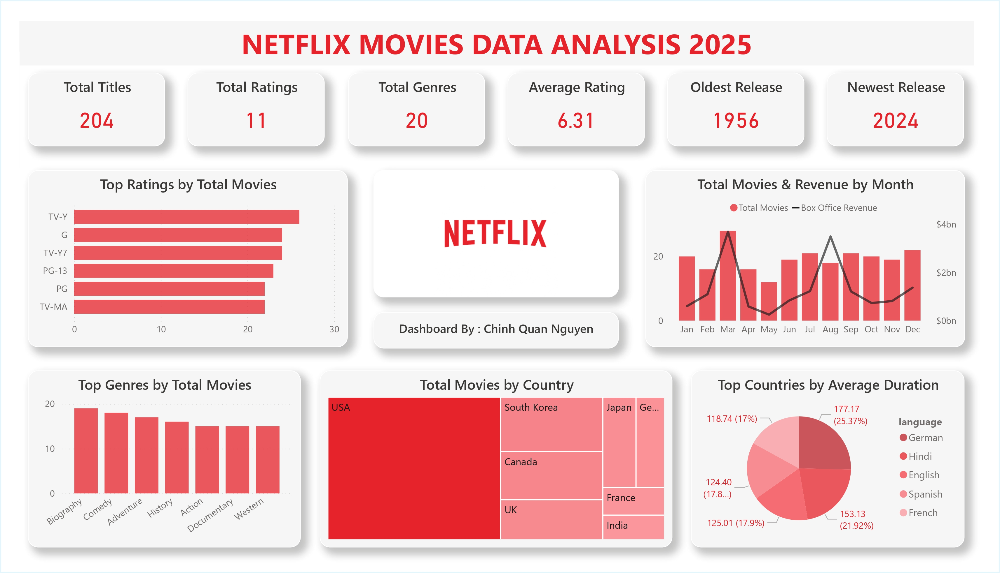

# Netflix Movies Analysis Dashboard

## Preview



## Overview

This project provides an analysis of Netflix content released in **2025**, focusing on movies. The dashboard, created with Power BI, offers insights into total titles, ratings distribution, genres, countries of production, and content characteristics.

## Key Insights

- Netflix released **204 movies** in 2025, spanning **20 genres** and **11 rating categories**, indicating broad content coverage with controlled scale.
- The **average movie rating is 6.31**, suggesting most Netflix movies fall into a mid-quality range rather than extreme highs or lows.
- **Biography, Comedy, and Adventure** are the most released genres, while Action and Documentary also maintain strong presence, reflecting a balance between entertainment and informational content.
- Movies rated **TV-Y, G, and TV-Y7** account for a high number of releases, highlighting Netflix’s emphasis on family-friendly and youth-oriented content.
- While multiple countries contribute to the catalog, production is heavily concentrated in the US. This highlights Netflix's strategy of using American-made content as the core engine to drive global viewership.
- Although fewer in number, some countries achieve **higher average movie durations**, suggesting regional differences in storytelling formats.
- Movie releases and box office revenue show **seasonal variation**, with noticeable peaks in early-year and mid-year months.

## Dataset
The dataset used in this project is sourced from **Kaggle**:  
[Netflix 2025 User Behavior Dataset (210K+ Records)](https://www.kaggle.com/datasets/sayeeduddin/netflix-2025user-behavior-dataset-210k-records)

For this analysis, a filtered subset was used, focusing on **Netflix titles released in 2025**.

After data cleaning and filtering, **204 movies with complete attributes were retained for analysis**.

Key highlights:
- Total Titles: 204
- Content Types: Movies
- Attributes: Title, Genre, Country, Release Year, Rating, Duration
- Scope: Netflix content released in 2025 only

The dataset was cleaned, filtered, and transformed within **Power BI** before visualization.

## Tools Used

- Power BI Desktop

## Usage

To explore the dashboard:

1. Download and install **Power BI Desktop**.
2. Clone this repository.
3. Open `Netflix_analysis_2025.pbix` using Power BI.
4. Interact with the dashboard to explore more insights.

## Project Structure

```text
.
├─ assets/
│  └─ netflix_icon.jpg
├─ dataset/
│  └─ movies.csv
├─ report/
│  └─ Netflix_analysis_2025.jpg
│  └─ Netflix_analysis_2025.pdf
├─ Netflix_analysis_2025.pbix
└─ README.md
```

## Contact

For inquiries and collaborations, feel free to reach out to chquan.nguyen@gmail.com.
